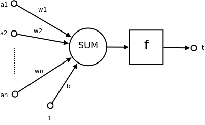

# 神經網路

## 甚麼是神經網路?

簡單來說就是模擬人類的神經網路，就好像我們一直學習某方得的知識，我們會越來越對該領域專精

## 定義:

引用維基百科的話
>人工神經網路目前沒有一個統一的正式定義。不過，具有下列特點的統計模型可以被稱作是「神經化」的：

>具有一組可以被調節的權重（被學習演算法調節的數值參數）
可以估計輸入資料的非線性函式關係
這些可調節的權重可以被看做神經元之間的連接強度。

# 構成:

>結構（Architecture）結構指定了網路中的變數和它們的拓撲關係。例如，神經網路中的變數可以是神經元連接的權重（weights）和神經元的激勵值（activities of the neurons）。

>激勵函式（Activation Rule）大部分神經網路模型具有一個短時間尺度的動力學規則，來定義神經元如何根據其他神經元的活動來改變自己的激勵值。一般激勵函式依賴於網路中的權重（即該網路的參數）。

>學習規則（Learning Rule）學習規則指定了網路中的權重如何隨著時間推進而調整。這一般被看做是一種長時間尺度的動力學規則。一般情況下，學習規則依賴於神經元的激勵值。它也可能依賴於監督者提供的目標值和當前權重的值。例如，用於手寫辨識的一個神經網路，有一組輸入神經元。輸入神經元會被輸入圖像的資料所激發。在激勵值被加權並通過一個函式（由網路的設計者確定）後，這些神經元的激勵值被傳遞到其他神經元。這個過程不斷重複，直到輸出神經元被激發。最後，輸出神經元的激勵值決定了辨識出來的是哪個字母。

示意圖:

特點:
在維度不同的時候學習很快，但在持續學習完成後就很難再有成果

## 梯度下降法
根據上課老師講的內容就是說要找斜率最大的那個方向然後找到一個谷底的點，因此在運用上只要可以找到最佳解惑逼近最佳解的項目即可使用梯度下降法，且在使用的對象有個前提就是該函數為可微分的函數
# 參考資料
[機器/深度學習-基礎數學(二):梯度下降法(gradient descent)](https://medium.com/@chih.sheng.huang821/%E6%A9%9F%E5%99%A8%E5%AD%B8%E7%BF%92-%E5%9F%BA%E7%A4%8E%E6%95%B8%E5%AD%B8-%E4%BA%8C-%E6%A2%AF%E5%BA%A6%E4%B8%8B%E9%99%8D%E6%B3%95-gradient-descent-406e1fd001f)

[老師的梯度下降法](https://misavo.com/blog/%E9%99%B3%E9%8D%BE%E8%AA%A0/%E6%9B%B8%E7%B1%8D/%E4%BA%BA%E5%B7%A5%E6%99%BA%E6%85%A7/03-%E7%A5%9E%E7%B6%93%E7%B6%B2%E8%B7%AF/B-%E6%A2%AF%E5%BA%A6%E4%B8%8B%E9%99%8D%E6%B3%95)

