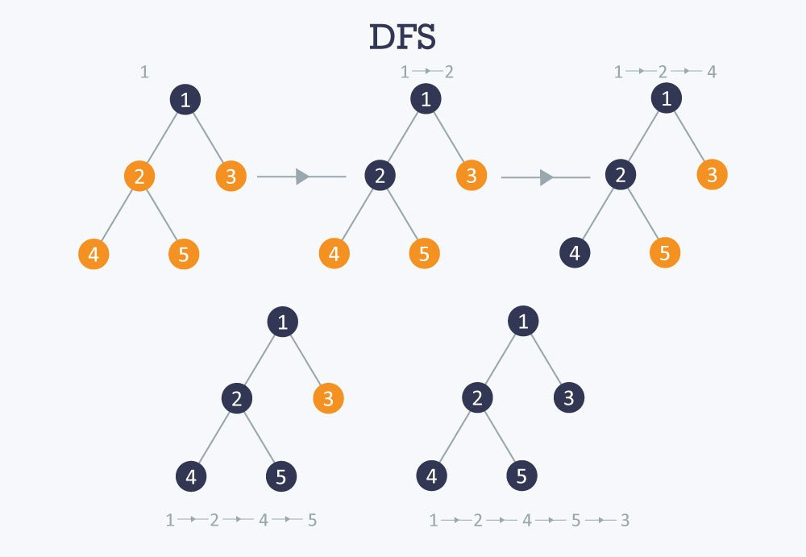
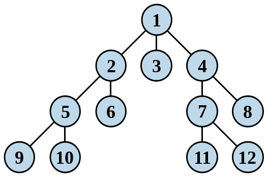

# 圖形搜尋

## 深度優先搜尋

深度優先搜尋，是指往最深的分支去探索，若查詢不到目標則退回上一個分支並往新的節點探索，因此反覆執行後全部的節點都會被探索過直到目標出現為止。

其順序如下示意圖

圖片引用自：[Depth First Search](https://www.hackerearth.com/zh/practice/algorithms/graphs/depth-first-search/tutorial/)

## 廣度優先搜尋
本節引用陳鍾誠老師的廣度搜尋
>雖然深度優先搜尋可以搜尋整個圖形，但是卻很可能繞了很久才找到目標，於是從起點到目標可能會花費很久的時間 (或說路徑長度過長)。

>如果我們想找出到達目標最少的步驟，那麼就可以採用「廣度優先搜尋」 (Breath-First Search, BFS) 的方式。

>廣度優先搜尋 BFS 是從一個節點開始，將每個鄰居節點都一層一層的拜訪下去，深度最淺的節點會優先被拜訪的方式。

其順序如下示意圖

本圖引用自: [wiki廣度搜尋法](https://zh.wikipedia.org/wiki/%E5%B9%BF%E5%BA%A6%E4%BC%98%E5%85%88%E6%90%9C%E7%B4%A2#/media/File:Breadth-first_tree.svg)

# 參考資料

[《演算法圖鑑》第四章：圖形搜尋](https://medium.com/change-or-die/%E6%BC%94%E7%AE%97%E6%B3%95%E5%9C%96%E9%91%91-%E7%AC%AC%E5%9B%9B%E7%AB%A0-%E5%9C%96%E5%BD%A2%E6%90%9C%E5%B0%8B-5f60214b2b4a)

[深度優先搜尋](https://zh.wikipedia.org/zh-tw/%E6%B7%B1%E5%BA%A6%E4%BC%98%E5%85%88%E6%90%9C%E7%B4%A2)

[廣度優先搜尋](https://zh.wikipedia.org/wiki/%E5%B9%BF%E5%BA%A6%E4%BC%98%E5%85%88%E6%90%9C%E7%B4%A2)

[老師的圖形的概念](https://misavo.com/blog/%E9%99%B3%E9%8D%BE%E8%AA%A0/%E6%9B%B8%E7%B1%8D/%E4%BA%BA%E5%B7%A5%E6%99%BA%E6%85%A7/04-%E5%9C%96%E5%BD%A2%E6%90%9C%E5%B0%8B/A-%E5%9C%96%E5%BD%A2%E7%9A%84%E6%A6%82%E5%BF%B5)